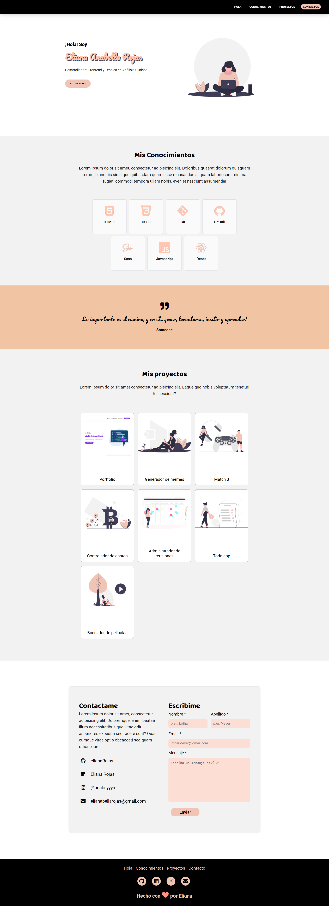

# Portfolio de Eliana Anabella Rojas

<br />


### Este es el primer proyecto del curso de Frontend de Ada. 

### Para su desarrollo se siguio el [diseño original](https://frontend-proyecto-portfolio.adaitw.org/) propuesto por Ada.
### En cuanto a la elección de los colores opte por un diseño simple, motivo por el cual decidi trabajar con una paleta de colores que abarca la escala de blanco a negro y algunos tonos de rosa o salmón. 

### Algunas modificacines al diseño original fueron: 
<br/>

* Header : el hover de cada uno de los elementos es un borde blanco, en lugar del cambio en el color de las letras.
* Skills : el hover consiste en un pequeño aumento de la imagen. En la vista de escritorio decidi que se vean 4 imagenes por fila, ya que considero que se ve mejor así.

<br />

## Comenzando 💻

***

<br />

### Ya te he contado de que trata el proyecto! A continuación te invito a ver mi portfolio. 😀

### Puedes verlo [aquí](elianarojas.github.io/portfolio/) o hacer click en el siguiente [link](https://quirky-gates-b52694.netlify.app).

<br />

## Crea una copia de mi repositorio 📝
***

<br />

### Para clonar mi repo en tu computadora puedes seguir los siguientes pasos: 

<br />

1. Ve a mi [repositorio](http://github.com/elianarojas/Portfolio)
2. Haz click en el botón que dice fork
3. Luego sobre el botón de color verde : `Code` 
4. Copia la URL que allí aparece
5. Abre tu terminal y pon el comando de ``` git clone <url>```
6. Entra a la carpeta del proyecto y abrelo desde tu IDE
7.  Listo!

<br />

## Pre-requisitos 🔧

***

<br />

### Este proyecto no necesita la instalación de ninguna dependencia, por ahora! 

<br />

## Vista previa del proyecto 🖌
***

<br />

### Así deberia verse el proyecto cuando lo abras en tu navegador

<br />



<!-- Si cambio la imagen se tiene que modificar acá también -->

<br />


## Expresiones de Gratitud 🎁

***

<br />

### Quiero agradecer a mi 🦆 , a mis compañeras del grupo *No seas malita* y a nuestro profe [Jonh Parra](https://github.com/Jonhks) que me han dado el empujon que me faltaba para meterle pilas al proyecto. 

<br />


***

<br />

##### ⌨ con ❤ por Eliana  !


